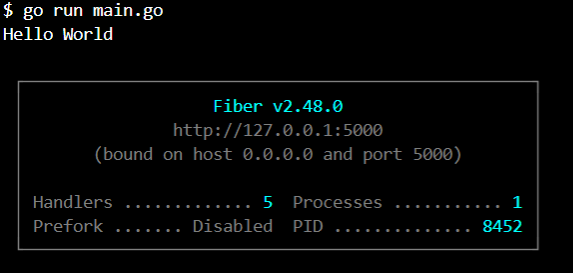

# Go APIs

## Description

Repo contains APIs written in Go. Some are built using Fiber and some are built from scratch with net/http. Each folders contains a README.md file with instructions on how to run and interact with the API.

## Commands to get started

```bash
go mod init github.com/username/repo
go get -u github.com/gofiber/fiber/v2
go get -u go.mongodb.org/mongo-driver/mongo
go get -u github.com/gofiber/fiber/v2/middleware/cors
```

## Run the app

```bash
go run main.go
```


